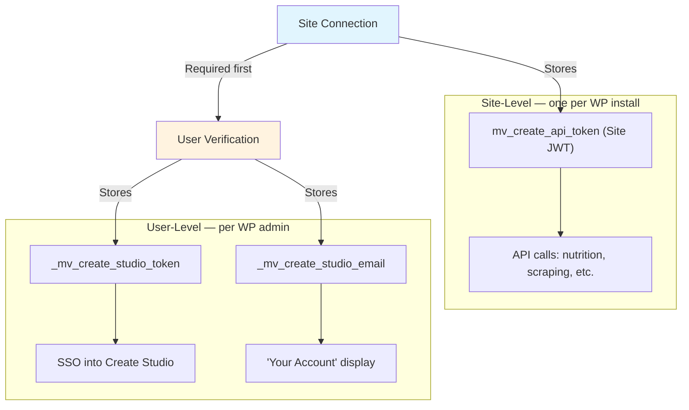

# Create Studio Authentication

Overview of how the Create WordPress plugin connects to Create Studio.

## Two-Level Connection

The plugin has two levels of connection with Create Studio:

### 1. [Site Connection](./SiteConnectionFlow.md) (required)

Connects the WordPress installation to Create Studio. One per site. Enables API features like nutrition calculation and link scraping.

- WP admin clicks "Connect to Create Studio" and is redirected to Studio
- Studio authenticates the user, then calls back to WP to deliver a **site JWT**
- JWT stored in `mv_settings` table, used for all API calls
- A one-time `connect_token` (transient, 10-min TTL) ensures the flow originated from WP

### 2. [User Verification](./UserVerificationFlow.md) (optional)

Links individual WP admin accounts to their personal Studio accounts. Per-user. Enables SSO, billing management, and dashboard access.

- WP creates a link session via server-to-server call (authenticated with site JWT)
- Admin is redirected to Studio to authenticate and link their account
- A **user token** is exchanged server-to-server and stored in WP user meta
- The Studio email can differ from the WP email

During site connection, the first admin's account is automatically linked (combined flow).

## Key Files

### WordPress Plugin

| File | Purpose |
|------|---------|
| `lib/settings/class-site-verification.php` | Site connection: initiate, callback, disconnect, site status |
| `lib/settings/class-user-verification.php` | User verification: initiate, complete, disconnect, SSO |
| `lib/settings/class-user-verification-meta.php` | Per-user meta helpers |
| `lib/settings/class-create-studio-client.php` | HTTP client for all Studio API calls |
| `admin/ui/src/views/Settings/index.tsx` | Settings page with connection state management |
| `admin/ui/src/views/Settings/components/CreateStudioSection.tsx` | Connected/unconnected site UI and "Your Account" card |

### Create Studio

| File | Purpose |
|------|---------|
| `server/api/v2/sites/connect.post.ts` | Site connection: create site, generate JWT, callback to WP |
| `server/api/v2/sites/[id]/auth/link.post.ts` | User verification: create link session |
| `server/api/v2/auth/link/complete.post.ts` | User verification: complete linking after auth |
| `server/api/v2/sites/[id]/auth/link/exchange.post.ts` | User verification: exchange session for token |
| `server/api/v2/auth/sso.post.ts` | SSO URL generation |
| `app/pages/auth/connect.vue` | Site connection confirmation page |
| `app/pages/auth/link.vue` | User account linking page |
| `server/db/schema.ts` | Database schema |
