# Site Connection Flow

Redirect-based flow for connecting a WordPress site to Create Studio. The WP admin clicks a button, authenticates on Studio, and Studio delivers a site JWT back to WP via server-to-server callback.

## Overview

Since site connection has no pre-existing token (establishing that token is the whole point), we use a one-time `connect_token` generated by WP and passed through the redirect URL. Studio sends it back via a server-to-server callback to WP, proving the flow originated from that WP instance.

## Flow

```mermaid
sequenceDiagram
    participant Admin as WP Admin
    participant WP as Create Plugin
    participant DB as WP Settings DB
    participant Studio as Create Studio API
    participant StudioUI as Studio Auth/Connect Pages

    Note over Admin: Clicks "Connect to Create Studio"

    rect rgb(90, 90, 90)
        Note over Admin,WP: Step 1: Initiate connection
        Admin->>WP: POST /studio/site-connect/initiate
        WP->>DB: Generate connect_token (64-char random)<br/>Store in transient (10-min TTL)
        WP-->>Admin: {status: 'redirect', connect_url}
        Note over Admin: connect_url = https://create.studio/sites/connect<br/>?site_url=X&token=T&return_url=Y
    end

    rect rgb(90, 90, 90)
        Note over Admin,StudioUI: Step 2: Authenticate on Studio
        Admin->>StudioUI: Browser navigates to connect_url
        alt Not logged in
            StudioUI->>StudioUI: Redirect to /auth/login<br/>?redirect=/sites/connect?site_url=X&token=T&return_url=Y
            Note over StudioUI: User logs in or registers
            StudioUI->>StudioUI: Redirect back to /sites/connect
        end
        Note over StudioUI: Shows "Connect {site_url} to your account?"
    end

    rect rgb(90, 90, 90)
        Note over StudioUI,WP: Step 3: Studio verifies site & delivers JWT
        Admin->>StudioUI: Clicks "Connect Site"
        StudioUI->>Studio: POST /api/v2/sites/connect<br/>{site_url, connect_token, return_url}
        Studio->>Studio: Find or create Site record<br/>Generate site JWT {site_id}
        Studio->>Studio: Create SiteUser (owner, verified)
        Studio->>Studio: Generate user_token for SiteUser
        Studio->>WP: POST https://{site_url}/wp-json/mv-create/v1/site-connect/callback<br/>{connect_token, jwt, site_id}
        WP->>DB: Verify connect_token matches stored token
        WP->>DB: Store jwt → mv_create_api_token
        WP->>DB: Clear connect_token (one-time use)
        WP-->>Studio: {success: true, site_name, wp_version, php_version, create_version}
        Studio->>Studio: Update site metadata from WP response
        Studio-->>StudioUI: {success, return_url, user_token, email}
    end

    rect rgb(90, 90, 90)
        Note over StudioUI,Admin: Step 4: Redirect back to WP
        StudioUI->>Admin: Redirect to return_url?connected=true
        Note over Admin: Settings page detects ?connected param
        Admin->>WP: GET /studio/site-status
        WP->>Studio: GET /sites/status (Bearer: site JWT)
        Studio-->>WP: {connected: true, subscription_tier, ...}
        WP-->>Admin: {connected: true, ...}
        Note over Admin: Shows "Connected to Create Studio"
    end
```

## Bonus: Combined Site + User Linking

Since the admin is already authenticated on Studio during site connection, we can link their personal account in the same flow — no separate user verification step needed for the first user.

```mermaid
sequenceDiagram
    participant Admin as WP Admin
    participant WP as Create Plugin
    participant Studio as Create Studio API

    Note over Admin: After ?connected redirect...

    rect rgb(90, 90, 90)
        Note over Admin,Studio: Automatic user linking (first user only)
        Note over Admin: Settings page detects ?connected param
        Admin->>WP: POST /studio/user-verify/complete<br/>{from_connect: true}
        WP->>Studio: POST /sites/:id/auth/link/exchange<br/>Bearer: site JWT<br/>{from_connect: true}
        Studio-->>WP: {user_token, email, verified_at}
        WP->>WP: Store in user meta
        WP-->>Admin: {site_connected: true, user_verified: true, email}
        Note over Admin: Shows connected site + linked account immediately
    end
```

**Alternative:** Studio could pass user linking data (user_token, email) back in the callback response during Step 3, and WP stores both the site JWT and user token at once. This avoids an extra round-trip but couples the two flows.

## Security Model

### What proves WP admin initiated this flow?
The `connect_token` is generated by WP (requires `manage_options` capability) and stored in a transient. Only someone with WP admin access can generate one.

### What proves Studio is the legitimate responder?
Studio sends the `connect_token` back to WP's callback endpoint via server-to-server HTTPS. WP verifies it matches the stored token (timing-safe comparison). An attacker would need both the token AND the ability to call WP's endpoint.

### What prevents replay attacks?
- Token is one-time use (cleared after successful callback)
- Token expires after 10 minutes
- Token is 64 characters of cryptographic randomness

### What about the token being in the URL?
The connect_token is visible in the browser URL during the redirect. This is acceptable because:
- It travels over HTTPS (encrypted in transit)
- It's short-lived and one-time use
- The same admin who has WP access is the one clicking through
- This is equivalent to OAuth authorization codes, which also travel in URLs

### Site reachability verification
Studio's callback to WP's REST endpoint serves double duty:
1. Delivers the JWT securely (server-to-server)
2. Verifies the site is publicly reachable (required for Studio features like nutrition API)

## API Endpoints

### WordPress: New/Modified Endpoints

#### `POST /mv-create/v1/studio/site-connect/initiate`
Generate connect token and return Studio redirect URL.

- **Auth**: WP admin (manage_options capability)
- **Response**: `{ status: 'redirect', connect_url: string }` or `{ status: 'already_connected' }`
- **Behavior**:
  - Check if already connected (mv_create_api_token exists + valid) → return early
  - Generate 64-char random connect_token
  - Store in transient `mv_create_connect_token` (10-min TTL)
  - Build connect_url with site_url, token, and return_url
  - Return redirect URL

#### `POST /mv-create/v1/site-connect/callback` (public, no WP auth)
Receive JWT from Studio after successful verification.

- **Auth**: None (public endpoint) — authenticated by connect_token
- **Body**: `{ connect_token: string, jwt: string, site_id: number }`
- **Response**: `{ success: true, site_name, wp_version, php_version, create_version }`
- **Behavior**:
  - Retrieve stored connect_token from transient
  - Timing-safe compare submitted token vs stored token
  - Store JWT → `mv_create_api_token` setting
  - Delete transient (one-time use)
  - Return site metadata

#### `GET /mv-create/v1/studio/site-status` (unchanged)
Existing endpoint — checks connection status against Studio.

### Studio: New Endpoints

#### `POST /api/v2/sites/connect`
Create site record and deliver JWT to WordPress via callback.

- **Auth**: User session (cookie)
- **Body**: `{ site_url: string, connect_token: string, return_url: string }`
- **Response**: `{ success: true, return_url: string, user_token?: string, email?: string }`
- **Behavior**:
  - Validate and normalize site_url (HTTPS, no private IPs)
  - Find or create Site record (canonical)
  - Generate site JWT containing `{ site_id }`
  - Create SiteUser record (owner role, verified)
  - Generate user_token for the SiteUser
  - **Callback to WP**: `POST https://{site_url}/wp-json/mv-create/v1/site-connect/callback`
    - Body: `{ connect_token, jwt, site_id }`
    - Timeout: 15 seconds
  - If callback fails → return error (site not reachable)
  - If callback succeeds → update site metadata from response
  - Return success with return_url and optional user linking data

### Studio: New Page

#### `/sites/connect` (connect.vue)
Handles the site connection flow.

- On mount: read `site_url`, `token`, `return_url` from query params
- If not authenticated → redirect to `/auth/login?redirect=/sites/connect?...`
- If authenticated → show confirmation: "Connect {site_url} to your Create Studio account?"
- On confirm → call `POST /api/v2/sites/connect`
- On success → redirect to `return_url?connected=true`
- On error → show message (site not reachable, already connected by another user, etc.)

## Data Changes

### WordPress

| Setting | Change |
|---------|--------|
| `mv_create_connect_token` | **New** — transient, 10-min TTL, cleared after use |
| `mv_create_api_token` | Unchanged — still stores site JWT |
| `site_verification_code` | **Remove** — replaced by connect_token |
| `mv_create_api_user_id` | **Remove** — legacy, unused |
| `mv_create_api_email_confirmed` | **Remove** — handled by user verification |

### Studio

No schema changes needed — reuses existing Sites, SiteUsers, and Subscriptions tables.

## What Gets Removed

### WordPress
- `site_verification_code` generation and storage
- `verify-site-code` REST endpoint (Studio callback target for v1)
- `mv_create_generate_verification_code` AJAX handler
- Polling logic in `AuthenticationPrompt.tsx`
- Verification code UI (input, copy button, "I've verified" button)

### Studio
- `POST /sites/:id/verify` endpoint (v1 code verification)
- `POST /sites/add` endpoint (v1 pending site creation)
- Code verification UI in Studio admin

## Frontend Changes

### WordPress Settings Page

**AuthenticationPrompt.tsx** — Simplify to single button:
- Remove: verification code display, copy button, polling, "I've verified" button
- Keep: "Connect to Create Studio" button
- Add: handle `?connected` URL param detection

**CreateStudioSection.tsx** — No changes needed (already handles connected state).

**Settings/index.tsx**:
- Add `?connected` param detection (similar to `?linked` for user verification)
- On `?connected` → check site status → update connected state
- Optionally auto-link user if connect response includes user data

### Studio
- New `/sites/connect` page (similar to `/auth/link`)
- Reuses existing auth redirect pattern via `useAuthRedirect` composable

