# User Verification Flow

Redirect-based flow for linking individual WP admin accounts to their personal Create Studio accounts. Uses the existing site JWT for server-to-server authentication and a short-lived link session for the browser redirect.

## Overview

Uses the site JWT as proof of WP admin access. The site JWT is only accessible to WP admins (stored in `mv_settings`, requires `manage_options` capability). If someone has it, they're authorized to manage the site.

## Flow

```mermaid
sequenceDiagram
    participant Admin as WP Admin
    participant WP as Create Plugin
    participant Meta as WP User Meta
    participant Studio as Create Studio API
    participant StudioAuth as Studio Auth Pages

    Note over Admin: Clicks "Link Your Account"

    rect rgb(90, 90, 90)
        Note over Admin,Studio: Step 1: Create link session
        Admin->>WP: POST /studio/user-verify/initiate
        WP->>Meta: Check if already verified locally
        alt Already verified
            WP-->>Admin: {status: 'already_verified', email, avatarUrl}
        else Not verified
            WP->>Studio: POST /sites/:id/auth/link<br/>Bearer: site JWT<br/>body: {return_url}
            Studio->>Studio: Create LinkSession<br/>(session_id, site_id, expires 10min)
            Studio-->>WP: {link_url, session_id}
            WP->>Meta: Store session_id temporarily
            WP-->>Admin: {status: 'redirect', link_url}
        end
    end

    rect rgb(90, 90, 90)
        Note over Admin,StudioAuth: Step 2: Authenticate on Studio
        Admin->>StudioAuth: Browser navigates to link_url<br/>(/auth/link?session=abc123)
        alt Not logged in
            StudioAuth->>StudioAuth: Redirect to /auth/login?redirect=/auth/link?session=abc123
            Note over StudioAuth: User logs in or registers
            StudioAuth->>StudioAuth: Redirect back to /auth/link?session=abc123
        end
        Note over StudioAuth: Studio auto-links logged-in user to site
        StudioAuth->>Studio: POST /auth/link/complete<br/>{session_id} + user session
        Studio->>Studio: Validate session, create SiteUser<br/>Mark verified, generate user_token
        Studio->>Studio: Store user_token on LinkSession
        Studio-->>StudioAuth: {success, user_token}
        StudioAuth->>Admin: Redirect to return_url?mv_linked=session_id
    end

    rect rgb(90, 90, 90)
        Note over Admin,Studio: Step 3: Exchange session for token
        Note over Admin: Settings page detects ?mv_linked param
        Admin->>WP: POST /studio/user-verify/complete<br/>{session_id}
        WP->>Studio: POST /sites/:id/auth/link/exchange<br/>Bearer: site JWT<br/>{session_id}
        Studio->>Studio: Validate session, return user data
        Studio->>Studio: Delete LinkSession (one-time use)
        Studio-->>WP: {user_token, email, avatarUrl, verified_at}
        WP->>Meta: Store token + email in user meta
        WP-->>Admin: {status: 'verified', email, avatarUrl}
        Note over Admin: Show "Your Account" with Studio email
    end
```

## Key Design Decisions

### Why a link session instead of passing the JWT directly?

The site JWT is a long-lived secret. Putting it in a URL would expose it in browser history, server logs, and referrer headers. Instead, WP calls Studio server-to-server to create a short-lived link session (10 min TTL), and only the session ID goes in the URL.

### Why redirect back to WP instead of polling?

The redirect carries a `?mv_linked=session_id` query parameter. When the Settings page loads with this param, it immediately exchanges the session for a user token. No polling needed.

### Why a separate exchange step?

The link session stores the user_token after Studio links the user. But we don't pass the token in the redirect URL (it's sensitive). Instead, WP does a server-to-server call (authenticated with the site JWT) to retrieve it. The session is deleted after exchange (one-time use).

### What happens if the user closes the Studio tab?

Nothing bad. The link session expires after 10 minutes. The user can click "Link Your Account" again to start a new session.

## API Endpoints

### Studio: New Endpoints

#### `POST /api/v2/sites/:id/auth/link`

Create a link session for user verification.

- **Auth**: Bearer site JWT
- **Body**: `{ return_url: string }` — the WP admin URL to redirect back to
- **Response**: `{ link_url: string, session_id: string }`
- **Behavior**:
  - Validates site JWT, confirms site exists
  - Checks if site already has a verified user → returns `{ status: 'already_verified' }` if so
  - Creates a `LinkSession` record: `{ id, site_id, return_url, created_at, expires_at }`
  - Returns `link_url` pointing to `/auth/link?session={session_id}`

#### `POST /api/v2/auth/link/complete`

Complete user linking (called from Studio frontend after auth).

- **Auth**: User session (cookie)
- **Body**: `{ session_id: string }`
- **Response**: `{ success: true, site_name: string, site_url: string, return_url: string }`
- **Behavior**:
  - Validates session exists and hasn't expired
  - Creates/updates SiteUser for logged-in user + session's site_id
  - Marks verified, generates user_token, stores on session
  - Returns site info + return_url for the redirect

#### `POST /api/v2/sites/:id/auth/link/exchange`

Exchange a completed link session for the user token (called from WP server-side).

- **Auth**: Bearer site JWT
- **Body**: `{ session_id: string }`
- **Response**: `{ user_token: string, email: string, avatarUrl: string, verified_at: string }`
- **Behavior**:
  - Validates site JWT matches session's site_id
  - Validates session is completed (has user_token)
  - Returns user data
  - Deletes the session (one-time use)

### Studio: New Page

#### `/auth/link` (link.vue)

Minimal page that handles the link flow.

- On mount: check `?session` query param
- If not authenticated → redirect to `/auth/login?redirect=/auth/link?session=xxx`
- If authenticated → call `POST /api/v2/auth/link/complete` with session_id
- On success → redirect to `return_url?mv_linked=session_id`

### WordPress: Modified Endpoints

#### `POST /studio/user-verify/initiate` (modified)

- Remove verification code generation
- Instead: call Studio `POST /sites/:id/auth/link` with `return_url`
- Store `session_id` in user meta temporarily
- Return `{ status: 'redirect', link_url }` to frontend

#### `POST /studio/user-verify/complete` (new)

- Accept `{ session_id }` from frontend
- Call Studio `POST /sites/:id/auth/link/exchange` with session_id
- Store returned `user_token`, `email`, etc. in user meta
- Clear temporary session_id from meta
- Return `{ status: 'verified', email, avatarUrl }`

#### `GET /studio/user-verify/status` (simplified)

- Only checks local user meta (no more polling Studio)
- Returns current verification state

### WordPress: Frontend Changes

#### Settings page (`index.tsx`)

- Remove polling logic (`startUserPolling`, `stopUserPolling`, interval/timeout refs)
- `handleInitiateUserVerification()`: on `redirect` status, open `link_url` in same tab or popup
- On page load: detect `?mv_linked=session_id` query param → call `POST /studio/user-verify/complete` → update UI
- Remove `userPollTimedOut` state

#### CreateStudioSection.tsx

- Remove "pending" verification code UI (no more code display, copy button, polling indicator)
- Simplify to two states: **unverified** (show "Link Your Account" button) and **verified** (show account info)

## Data Changes

### Studio: New Table

`link_sessions` table:

| Column | Type | Description |
|--------|------|-------------|
| `id` | text (UUID) | Primary key |
| `site_id` | integer | FK to Sites |
| `user_id` | integer (nullable) | FK to Users (set after auth) |
| `user_token` | text (nullable) | Generated after linking |
| `return_url` | text | WP admin URL to redirect back to |
| `created_at` | text | ISO timestamp |
| `expires_at` | text | ISO timestamp (created_at + 10 min) |

### Studio: Removed

- `Sites.pending_verification_code` column (can be dropped after migration)

### WordPress: User Meta Changes

| Meta Key | Change |
|----------|--------|
| `_mv_create_studio_verification_code` | **Remove** — no longer needed |
| `_mv_create_studio_link_session` | **New** — temporary session_id during linking |
| `_mv_create_studio_token` | Unchanged |
| `_mv_create_studio_email` | Unchanged |
| `_mv_create_studio_verified_at` | Unchanged |

## What Gets Removed

### Studio
- `POST /sites/:id/users/verify/initiate` endpoint
- `GET /sites/:id/users/verify/status` endpoint
- `POST /users/verify` endpoint
- `/auth/verify-user.vue` page
- `Sites.pending_verification_code` column
- `SiteRepository.findByPendingVerificationCode()`
- `SiteRepository.setPendingVerificationCode()`
- `SiteRepository.clearPendingVerificationCode()`

### WordPress
- Verification code generation/formatting in `User_Verification_Meta`
- Polling logic in `Settings/index.tsx`
- Pending/code UI in `CreateStudioSection.tsx`
- `Create_Studio_Client::check_verification_status()`

